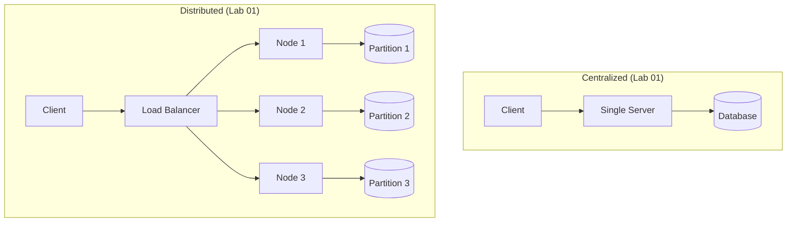

# Session 1: Introduction to Distributed Systems (3 Hours)

> **Instructor Guide** — Hands-on, practical-first approach  
> **Goal:** Students leave with Docker clusters running and measurable proof of distributed vs centralized tradeoffs

---

## Hour 1: What Is a Distributed System? (~75 min)

### Opening Demo (10 min) — Don't lecture, SHOW

> **Do this live:** Open 3 terminals. Run a single Python HTTP server. Hit it with `wrk` or `ab`. Show the bottleneck. Then spin up 3 Docker containers behind a load balancer. Hit again. Show the throughput difference. That's your opening slide.

**Before running this, ground the demo in one sentence each:**
- A **server** here is just a program on your computer that sits and waits for other programs to send it requests (like a shopkeeper waiting behind a counter for customers).
- `ab` (Apache Bench) is a tool that acts like hundreds of impatient customers arriving at once, so you can see how the shopkeeper copes under load. "Throughput" simply means "how many customers got served per second."
- A **container** (Docker) is a lightweight, disposable, pretend computer — you can create and destroy dozens of them on your one real laptop in seconds. Think of it as a shipping container: whatever is packed inside it runs the same way no matter which ship (physical machine) carries it.
- A **load balancer** is just a receptionist standing in front of several servers, deciding which server each new customer gets sent to, so no single server gets overwhelmed.

```bash
# Single server
python3 -m http.server 8080 &
ab -n 1000 -c 50 http://localhost:8080/

# Now kill it — what happens? Everything dies. Single point of failure.
```

A **single point of failure (SPOF)** is any one component whose failure takes down the whole system — like a single shopkeeper who, if they go home sick, means the shop simply closes with no backup.

**Key question to the class:** *"What broke? What would you want instead?"*

This naturally leads into:

- **Definition — what is a distributed system?** In plain terms: it's a collection of independent computers that don't share memory or a physical clock, connected only by a network, but that present themselves to the user as *one single system*. Analogy: think of a restaurant chain with kitchens in five different cities, all using the same recipes and the same ordering app — from the customer's perspective it feels like "one restaurant," even though there is no single kitchen and no single manager who can see everything happening everywhere at once.
- **Characteristics** — the properties we actually want from that collection of machines:
  - **Transparency** — the user shouldn't have to know or care *which* physical machine is doing the work, the same way you don't need to know which specific delivery driver or warehouse fulfilled your online order.
  - **Openness** — different pieces (possibly built by different teams, in different languages) should be able to work together, the way any standard electrical plug fits any standard socket regardless of who manufactured either one.
  - **Scalability** — the system should be able to grow (handle more users/data) mostly by adding more machines, rather than needing to replace everything with one giant machine.
  - **Fault tolerance** — the system should keep working, at least partially, even when some individual machines crash — unlike the single shopkeeper who has no backup.

### Comparison Table (5 min — project on screen)

A couple of terms in this table are worth unpacking out loud before you show it:
- **Vertical scaling** means making your *one* machine bigger/faster (more RAM, a faster CPU) — like replacing a small shop with a bigger shop, still with one shopkeeper. **Horizontal scaling** means adding *more* machines that share the work — like opening several smaller shops instead.
- **Latency** is simply "how long you wait for a response." A local call (talking to a program on your own machine) is fast; a network call (talking to a program on another machine, possibly in another city) is slower and less predictable, because the request has to physically travel and can get delayed or lost along the way.
- **Consistency** here means "do all copies of the data agree with each other, at all times?" With one copy of the data, there's nothing to disagree — trivially consistent. With many copies spread across machines, they can briefly disagree (e.g., one copy got the latest update, another hasn't received it yet), which is much harder to manage.
- The **CAP theorem** (you'll hear this term often in this field) says a distributed system can't simultaneously guarantee all three of: Consistency (all copies agree), Availability (every request gets a response), and Partition tolerance (the system keeps working even if the network between machines breaks). You have to pick which two to prioritize. It's fine to just flag this now — it comes back later in the module.

| Property | Centralized | Distributed |
|----------|-------------|-------------|
| Single point of failure | Yes | No (if designed right) |
| Scalability | Vertical only (bigger machine) | Horizontal (more machines) |
| Latency | Low (local) | Variable (network) |
| Consistency | Easy (one copy) | Hard (CAP theorem) |
| Cost | Expensive big machine | Cheap commodity hardware |
| Complexity | Simple | Complex |

### Lab 01: Centralized vs Distributed Benchmark (40 min)

**Hand out:** `labs/lab_01_what_is_distributed/`

Before students dive in, make sure two terms in the instructions are clear:
- A **key-value store** is the simplest possible database: it just remembers "for this label (key), store this piece of data (value)," and later lets you ask "what value did I store under this key?" — like a coat-check counter where you hand over your coat (value) and get a ticket number (key) to retrieve it later.
- **Partitioned** means the data is split up and spread across the 3 nodes, so no single node holds all of it — this is *how* a distributed system actually spreads out work, and it's the core idea of this whole lab.
- **p50 / p99 latency** just mean "the response time that 50% of requests were faster than" (p50 = the typical/median case) and "the response time that 99% of requests were faster than" (p99 = the response time you saw for one of your slowest, worst-case requests). p99 matters because it tells you about the bad days, not just the average day.

Students will:
1. Run a centralized key-value store (single Python process)
2. Run 3 distributed nodes (Docker) with a simple partitioned key-value store
3. Benchmark both with `time` and measure:
   - Throughput (requests/sec)
   - Latency (p50, p99)
   - What happens when one node dies?

**Checkpoint question:** *"Which was faster for reads? Which was faster for writes? Why?"*

---

### Real-World Case Study: Google's Distributed Infrastructure (10 min)

> Don't just tell them — show them the numbers.

A one-line plain-language gloss for each row, since these product names won't mean anything yet:
- **GFS/Colossus** — a system for storing enormous numbers of files spread across thousands of machines, instead of one giant hard drive (which couldn't physically be big enough anyway).
- **Bigtable** — a database, similar in spirit to the key-value store from Lab 01 but built to hold far more data than any single machine could store.
- **Spanner** — a database that stays consistent (all copies agree) even though it's spread across data centers on different continents — a genuinely hard problem, which is why it's called out specifically.
- **MapReduce** — a way of splitting one huge computation (e.g., "count word frequencies across the entire web") into thousands of small pieces that run in parallel on different machines, then combining the results.

| System | What it does | Scale |
|--------|-------------|-------|
| **GFS/Colossus** | Distributed file system | Exabytes of data |
| **Bigtable** | Distributed database | Billions of rows |
| **Spanner** | Globally distributed SQL | Externally consistent |
| **MapReduce** | Distributed computation | Thousands of machines |

**Key insight:** *"Google couldn't buy a bigger computer. They had to distribute. That's why this field exists."* (An "exabyte," for scale: 1 exabyte = 1 million terabytes. No single hard drive — no matter how expensive — comes close, so "just buy a bigger machine" genuinely stops being an option at this scale.)

---

## Hour 2: DOS vs NOS (~60 min, after break)

Set this up before the table: an **operating system (OS)** is the software layer (like Windows, macOS, or Linux) that manages a computer's hardware and lets programs run on it. When you have *many* computers networked together, someone has to decide how much that collection of computers "feels like one machine" versus "feels like a bunch of separate machines you have to manage individually." That's the whole DOS vs NOS distinction:
- A **Distributed OS (DOS)** tries to hide the fact that there are multiple machines at all — from the user's point of view, it should feel like one big computer, even though the work is spread across many. This is the "single system image" idea.
- A **Network OS (NOS)** is what you actually use every day: a bunch of ordinary, individual operating systems (each machine running its own copy of Linux, say) that are simply connected by a network, and you're aware you're dealing with separate machines (you explicitly log into machine A, then separately copy a file to machine B, etc.).

### Comparison Table (5 min)

| Feature | Distributed OS (DOS) | Network OS (NOS) |
|---------|----------------------|-------------------|
| **User view** | Single system image | Collection of machines |
| **Resource sharing** | Transparent (shared memory illusion) | Explicit (mount/SSH) |
| **Process migration** | Automatic | Manual |
| **Example** | Amoeba, Plan 9 | Linux + NFS, Windows Server |
| **Complexity** | Very high | Moderate |
| **Real-world usage** | Mostly research/historical | Everywhere today |

A few phrases in that table worth unpacking:
- **"Shared memory illusion"** — in a true DOS, when one program writes data, every other program on any node can supposedly just read it directly, as if it were sitting in the same computer's memory, even though behind the scenes it's really being shipped over the network. It's an "illusion" because the system fakes this seamlessness for you.
- **"Explicit (mount/SSH)"** — in a NOS, if you want data from another machine, you take a deliberate action: **SSH** (Secure Shell) is how you remotely log into another machine's terminal, and "mount" means attaching another machine's shared folder into your own so it shows up like a local folder. Either way, *you* have to set it up — nothing happens automatically.
- **Amoeba and Plan 9** are historical research operating systems built in the 1980s–90s specifically to explore the "everything feels like one machine" DOS idea. They're mentioned because true DOSes mostly stayed in research labs — the industry ended up standardizing on the NOS approach (ordinary OSes + networking), which is why "Linux + NFS" (Network File System, a common way to share folders over a network) and "Windows Server" are what you'll actually encounter in the real world.
- **Process migration** means moving a program that is *already running* from one machine to another, without restarting it from scratch — automatic in a DOS's ideal vision, but something you'd have to build and manage by hand in a NOS.

### Lab 02: DOS vs NOS in Docker (55 min)

**Hand out:** `labs/lab_02_dos_vs_nos/`

Students build TWO Docker Compose setups:

**Setup A — NOS Simulation:**
- 3 containers, each with their own filesystem
- Shared directory via Docker volume mount (simulates NFS)
- Students SSH between containers, copy files manually
- **Feel the pain:** No transparency, everything is explicit

**Setup B — DOS Simulation:**
- 3 containers sharing a Redis-backed "shared memory" 
- Any container writes to "memory" → all containers see it instantly
- Process "migration": start a task on node1, checkpoint, resume on node2
- **Feel the magic:** Location transparency (you don't know which node has your data)

**Checkpoint challenge:** *"Write a file on node1. Read it from node3. How many lines of code did it take in NOS vs DOS mode?"*

---

## Hour 3: Wrap-up + Mini Assessment (~30 min)

### Quick-Fire Quiz (15 min)

Run these as live class discussions:

1. **"Your startup has 10,000 users. One server handles it fine. Should you distribute?"**
   - Answer: Probably not yet. Distribution adds complexity. Don't distribute unless you need to.

2. **"Name 3 things that can go wrong in a distributed system that can't go wrong in a centralized one."**
   - **Network partitions** (the network link between two machines breaks, even though both machines are still running fine — like a phone line going dead mid-call), **clock skew** (each machine has its own internal clock, and they're never perfectly in sync, so "which event happened first?" gets genuinely ambiguous across machines), **partial failures** (some machines crash while others keep running — unlike a single machine, which is either fully up or fully down).

3. **"Is Kubernetes a DOS or NOS? Defend your answer."**
   - (Kubernetes is a very widely used tool for automatically running and managing many containers across many machines — students may not have met it yet, which is fine, just describe it that way.) It's a NOS (you still see individual pods/nodes — a "pod" is Kubernetes' name for one running group of containers), but it borrows DOS ideas (transparent scheduling — it decides which machine runs your program without you choosing — and service discovery, where programs can find and talk to each other by name without knowing which physical machine the other one is on).

4. **Kill a node in the Lab 02 DOS setup. What happens?**
   - Let them try it live. Redis is the SPOF (single point of failure, defined earlier) — discuss.

### Architecture Diagram — What We Built Today



### Bridge to Session 2

> *"We've seen WHY distributed systems exist and WHAT they look like. Tomorrow we answer HOW: How do these nodes talk to each other? (TCP/IP, RPC) How do they coordinate? (Mutual exclusion, deadlocks) Let's go deeper."*

---

## Instructor Notes

- **Common pitfall:** Students conflate "using multiple servers" with "distributed system." Emphasize: a distributed system has no shared clock, no shared memory, and components can fail independently.
- **Docker tip:** Pre-pull all images before class: `docker pull python:3.11-slim redis:7-alpine golang:1.21-alpine`
- **If students are ahead:** Challenge them to add a 4th node to the distributed KV store and re-partition the data.
