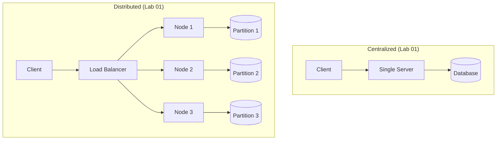

# Session 1: Introduction to Distributed Systems (3 Hours)

> **Instructor Guide** — Hands-on, practical-first approach  
> **Goal:** Students leave with Docker clusters running and measurable proof of distributed vs centralized tradeoffs

---

## Hour 1: What Is a Distributed System? (0:00 – 1:15)

### Opening Demo (10 min) — Don't lecture, SHOW

> **Do this live:** Open 3 terminals. Run a single Python HTTP server. Hit it with `wrk` or `ab`. Show the bottleneck. Then spin up 3 Docker containers behind a load balancer. Hit again. Show the throughput difference. That's your opening slide.

```bash
# Single server
python3 -m http.server 8080 &
ab -n 1000 -c 50 http://localhost:8080/

# Now kill it — what happens? Everything dies. Single point of failure.
```

**Key question to the class:** *"What broke? What would you want instead?"*

This naturally leads into: **Definition**, **Characteristics** (transparency, openness, scalability, fault tolerance).

### Comparison Table (5 min — project on screen)

| Property | Centralized | Distributed |
|----------|-------------|-------------|
| Single point of failure | Yes | No (if designed right) |
| Scalability | Vertical only (bigger machine) | Horizontal (more machines) |
| Latency | Low (local) | Variable (network) |
| Consistency | Easy (one copy) | Hard (CAP theorem) |
| Cost | Expensive big machine | Cheap commodity hardware |
| Complexity | Simple | Complex |

### Lab 01: Centralized vs Distributed Benchmark (40 min)

**Hand out:** `labs/lab_01_what_is_distributed/`

Students will:
1. Run a centralized key-value store (single Python process)
2. Run 3 distributed nodes (Docker) with a simple partitioned key-value store
3. Benchmark both with `time` and measure:
   - Throughput (requests/sec)
   - Latency (p50, p99)
   - What happens when one node dies?

**Checkpoint question:** *"Which was faster for reads? Which was faster for writes? Why?"*

---

### Real-World Case Study: Google's Distributed Infrastructure (10 min)

> Don't just tell them — show them the numbers.

| System | What it does | Scale |
|--------|-------------|-------|
| **GFS/Colossus** | Distributed file system | Exabytes of data |
| **Bigtable** | Distributed database | Billions of rows |
| **Spanner** | Globally distributed SQL | Externally consistent |
| **MapReduce** | Distributed computation | Thousands of machines |

**Key insight:** *"Google couldn't buy a bigger computer. They had to distribute. That's why this field exists."*

---

## Hour 2: DOS vs NOS (1:30 – 2:30, after break)

### Comparison Table (5 min)

| Feature | Distributed OS (DOS) | Network OS (NOS) |
|---------|----------------------|-------------------|
| **User view** | Single system image | Collection of machines |
| **Resource sharing** | Transparent (shared memory illusion) | Explicit (mount/SSH) |
| **Process migration** | Automatic | Manual |
| **Example** | Amoeba, Plan 9 | Linux + NFS, Windows Server |
| **Complexity** | Very high | Moderate |
| **Real-world usage** | Mostly research/historical | Everywhere today |

### Lab 02: DOS vs NOS in Docker (55 min)

**Hand out:** `labs/lab_02_dos_vs_nos/`

Students build TWO Docker Compose setups:

**Setup A — NOS Simulation:**
- 3 containers, each with their own filesystem
- Shared directory via Docker volume mount (simulates NFS)
- Students SSH between containers, copy files manually
- **Feel the pain:** No transparency, everything is explicit

**Setup B — DOS Simulation:**
- 3 containers sharing a Redis-backed "shared memory" 
- Any container writes to "memory" → all containers see it instantly
- Process "migration": start a task on node1, checkpoint, resume on node2
- **Feel the magic:** Location transparency (you don't know which node has your data)

**Checkpoint challenge:** *"Write a file on node1. Read it from node3. How many lines of code did it take in NOS vs DOS mode?"*

---

## Hour 3: Wrap-up + Mini Assessment (2:30 – 3:00)

### Quick-Fire Quiz (15 min)

Run these as live class discussions:

1. **"Your startup has 10,000 users. One server handles it fine. Should you distribute?"**
   - Answer: Probably not yet. Distribution adds complexity. Don't distribute unless you need to.

2. **"Name 3 things that can go wrong in a distributed system that can't go wrong in a centralized one."**
   - Network partitions, clock skew, partial failures

3. **"Is Kubernetes a DOS or NOS? Defend your answer."**
   - NOS (you still see individual pods/nodes), but it borrows DOS ideas (transparent scheduling, service discovery)

4. **Kill a node in the Lab 02 DOS setup. What happens?**
   - Let them try it live. Redis is the SPOF — discuss.

### Architecture Diagram — What We Built Today



### Bridge to Session 2

> *"We've seen WHY distributed systems exist and WHAT they look like. Tomorrow we answer HOW: How do these nodes talk to each other? (TCP/IP, RPC) How do they coordinate? (Mutual exclusion, deadlocks) Let's go deeper."*

---

## Instructor Notes

- **Common pitfall:** Students conflate "using multiple servers" with "distributed system." Emphasize: a distributed system has no shared clock, no shared memory, and components can fail independently.
- **Docker tip:** Pre-pull all images before class: `docker pull python:3.11-slim redis:7-alpine golang:1.21-alpine`
- **If students are ahead:** Challenge them to add a 4th node to the distributed KV store and re-partition the data.
