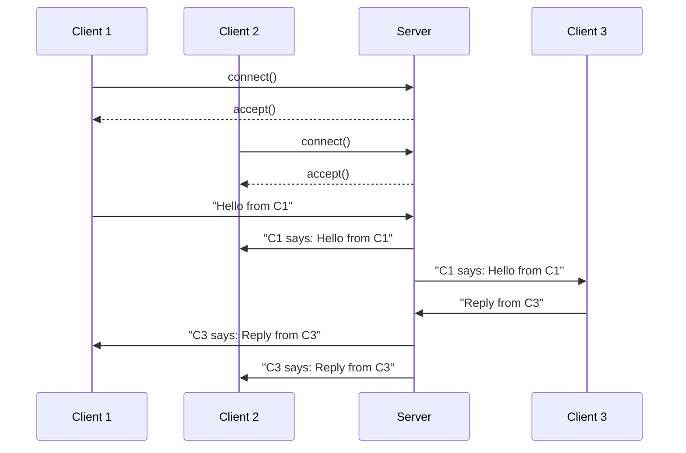
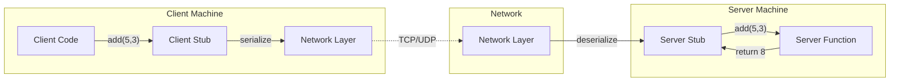
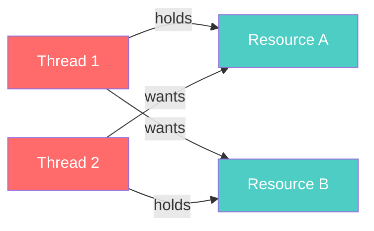
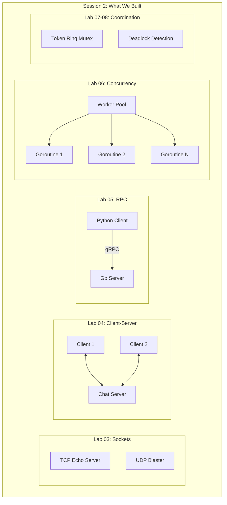

# Session 2: Communication & Synchronization (5 Hours)

> **Instructor Guide** — Practical-first, build real distributed systems  
> **Goal:** Students implement TCP/IP sockets, client-server, RPC/gRPC, goroutines, mutex algorithms, and deadlock detection

---

## Hour 1: Layered Protocols + TCP/IP (~45 min)

### Opening (5 min) — Skip the OSI lecture, do this instead

Before the live demo, set the scene: whenever two programs on different computers "talk" to each other, that conversation isn't one single thing — it's actually several layers of smaller conversations stacked on top of each other, each one solving a different, narrower problem (how do bits become electrical signals? how do those get to the right physical machine? how do they get to the right *program* on that machine? how does the data get interpreted correctly once it arrives?). This stack of layers is what "layered protocols" refers to — and the point of this hour is to make that stack visible and concrete rather than abstract.

> **Live demo:** Open Wireshark (or `tcpdump`). Make an HTTP request. Show the actual TCP handshake happening. Show the actual IP headers. *"This is what layered protocols look like in the real world."*

A few terms to define before running this:
- A **socket** is a program's handle on an open network connection — like a phone handset that lets a program "speak into" and "listen from" the network. Every piece of networking code in this session, in any language, ultimately creates and uses one of these.
- **Wireshark / tcpdump** are tools that let you watch the raw data traveling over a network connection, packet by packet, instead of it being invisible to you. Think of it as a security camera pointed at the network cable.
- A **packet** is just a small chunk of data traveling over the network, wrapped with some extra bookkeeping information (like an envelope with an address on it) so it can be routed and reassembled correctly.
- The **TCP handshake** is the short "hello, can you hear me? yes, can you hear me? yes" exchange (formally: SYN, SYN-ACK, ACK) that two programs perform before a TCP connection is considered open — similar to how a phone call starts with both people confirming they can hear each other before the real conversation begins.
- An **IP header** is the "address label" attached to each packet, containing (among other things) the sender's and receiver's IP addresses — the numeric addresses that identify machines on a network, similar to how a postal address identifies a building.

```bash
# In one terminal — capture packets
sudo tcpdump -i any port 8080 -X

# In another — send a request
curl http://localhost:8080/hello
```

### Protocol Layers — Practical View

Read this table top to bottom as "closest to the human" → "closest to the physical wire": the **Application** layer is where your own code lives and thinks in terms of meaningful requests ("get me this webpage"); the **Transport** layer (TCP/UDP) breaks that into a reliable (or not) stream of bytes and tracks which program on the machine should receive it (via **ports** — think of a port number as an apartment number: the IP address gets you to the right building/machine, the port gets you to the right apartment/program); the **Network** layer (IP) figures out how to route a packet from one machine to another across possibly many intermediate networks; and the **Link** layer is the actual physical hardware (WiFi radio, Ethernet cable) moving raw signals, identified by **MAC addresses** (a unique ID burned into each network card, different from an IP address).

| Layer | Protocol | What you see in Wireshark | Your code touches? |
|-------|----------|--------------------------|-------------------|
| Application | HTTP, gRPC, DNS | Request/response body | Yes, always |
| Transport | TCP, UDP | Ports, seq numbers, ACKs | Yes, in this lab |
| Network | IP | Source/dest IP addresses | Rarely |
| Link | Ethernet, WiFi | MAC addresses | Never (usually) |

**Key insight:** *"You'll work at the Transport and Application layers today. The rest is handled by the OS and network hardware."* In practice this means: when you write `socket.socket(...)` in Python, you're speaking at the Transport layer — everything below that (getting bytes onto a wire, routing them across the internet) is handled for you automatically by the operating system and network hardware. You never have to write that part yourself.

### TCP vs UDP Comparison

Both TCP and UDP are ways of sending data over a network at the Transport layer, but they make very different tradeoffs — worth explaining with an analogy before the table: **TCP is like a phone call** — you first establish a connection (someone has to pick up), and every word is guaranteed to arrive, in order, or you'll know something went wrong. **UDP is like shouting a message across a crowded room** — faster and simpler, no need to first confirm anyone's listening, but there's no guarantee the message arrives at all, arrives once, or arrives in the order you shouted things.

| Feature | TCP | UDP |
|---------|-----|-----|
| Connection | Connection-oriented (3-way handshake) | Connectionless |
| Reliability | Guaranteed delivery, ordering | Best-effort, no guarantees |
| Speed | Slower (overhead) | Faster (no overhead) |
| Use case | HTTP, file transfer, SSH | Video streaming, DNS, gaming |
| Header size | 20-60 bytes | 8 bytes |

(Video streaming and gaming favor UDP because a slightly dropped or out-of-order frame is barely noticeable and re-requesting it would arrive too late to matter anyway — better to keep moving than to pause and guarantee perfection.)

### Lab 03: Raw TCP/UDP Socket Programming (35 min)

**Hand out:** `labs/lab_03_tcp_ip_sockets/`

Quick refresher for students meeting Python's `socket` module for the first time: a **socket** is simply the programming handle for "an open connection over the network that I can write bytes into and read bytes out of" — creating one, binding it to an address, and calling `.accept()`/`.connect()` is the code-level equivalent of "picking up the phone, giving out your number, and dialing/answering a call."

Students build:
1. **TCP Echo Server** — accepts connections, echoes back messages (Python `socket`). "Echo" just means it sends back exactly what it received — the simplest possible server, useful for confirming your plumbing works before building anything more complex.
2. **UDP Message Blaster** — sends 1000 messages over UDP, counts how many arrive. This is the experiment that makes "best-effort, no guarantees" concrete: some messages will simply vanish, and that's expected, not a bug.
3. **Custom Protocol** — design a simple binary protocol header: `[MSG_TYPE:1byte][LENGTH:2bytes][PAYLOAD:Nbytes]`. This means: the first byte of every message tells the receiver what *kind* of message it is, the next two bytes say how many bytes of actual content follow, and then that many bytes of the real content (payload) come after. Any protocol — including HTTP — is built on this same basic idea of "a bit of structured bookkeeping in front of the real data" so the receiver knows how to interpret the bytes arriving over the wire.

**Checkpoint:** *"Send 1000 UDP messages across Docker containers. How many arrived? Now do the same with TCP. See the difference?"*

---

## Hour 2: Client-Server Model (~60 min)

### Context (5 min)

> *"Client-server is the most common architecture in distributed systems. Almost every app on your phone is a client. Let's build one that actually handles many clients at once."*

Define the two roles plainly: a **server** is a program that sits and waits, ready to respond to requests (like a helpdesk that's always staffed). A **client** is a program that initiates a request and waits for a response (like a customer who walks up to the helpdesk with a question). Almost everything you do on a computer or phone — checking email, loading a webpage, sending a message — is a client talking to some server somewhere. The diagram below shows the sequence of events when *multiple* clients talk to one server: each client independently opens a connection, and the server has to juggle all of them without getting confused about which message came from whom.



### Lab 04: Multi-Client Chat Server (55 min)

**Hand out:** `labs/lab_04_client_server/`

Students build a chat server that:
1. Accepts multiple TCP client connections concurrently (**"concurrently"** = handling many at roughly the same time, rather than one at a time, start to finish)
2. Broadcasts messages from any client to all other connected clients (i.e., it copies and re-sends the message to everyone else, like a group chat)
3. Handles client disconnects gracefully (if one client's connection drops, the server should notice and clean up, not crash or hang)
4. Runs across Docker containers (server on one, clients on others)

**Progressive challenges:**
- Phase 1: Single-threaded server (blocks on one client) — "blocks" means the server gets stuck waiting on whatever the first client is doing, and literally cannot respond to anyone else until that's done. Have students build this first specifically so they can *feel* the problem before fixing it.
- Phase 2: Multi-threaded server (handles many clients) — a **thread** is a separate, lightweight "worker" that runs inside the same program and can make progress independently, so the server can serve multiple clients at once instead of getting stuck on the first one.
- Phase 3: Add Docker networking — clients on different containers

**Checkpoint challenge:** *"Connect 5 clients from 3 different Docker containers. Kill one container. What happens to its clients? What happens to the server?"*

---

### BREAK (~15 min)

---

## Hour 3: Remote Procedure Call (~60 min)

### The "Aha" Moment (5 min)

> **Show this progression:**
> 1. Raw sockets: `sock.send(b"CALCULATE|add|5|3")` — painful
> 2. RPC: `result = remote_server.add(5, 3)` — feels like a local function call
> 
> *"RPC is just making a remote function call LOOK like a local one. That's the entire idea."*

Spell out why line 1 is "painful": every time you want the server to do something, you have to manually build a text message describing what you want, send raw bytes, and manually parse whatever bytes come back — all the plumbing is visible and you have to think about it every time. **RPC (Remote Procedure Call)** hides all of that plumbing behind what *looks* like an ordinary function call in your code (`remote_server.add(5, 3)`), even though, behind the scenes, it's still doing exactly the same send-bytes/receive-bytes work as line 1 — RPC just writes that boilerplate for you once, so you don't have to repeat it for every single call.

### RPC Architecture

A few new words in the diagram below: to **serialize** data means to convert it from "a value living in your program's memory" (like the numbers 5 and 3) into a flat sequence of bytes that can actually be sent over a network — and to **deserialize** is the reverse, turning received bytes back into a usable value on the other end. A **stub** is a small, auto-generated (or hand-written, in Part A of the lab) piece of code that stands in for the real function: the *client stub* pretends to be the server function so your client code can call it normally, and the *server stub* receives the incoming request and calls the real function on the server's behalf.



### Real-World Case Study: gRPC at Scale

| Company | How they use RPC |
|---------|-----------------|
| **Google** | gRPC — internal services communicate via protobuf |
| **Facebook** | Thrift — similar to gRPC, custom-built |
| **Netflix** | gRPC for inter-service communication |
| **Uber** | TChannel → gRPC migration |

**Key insight:** *"Every microservices architecture is essentially a collection of RPC calls."*

### Lab 05: RPC from Scratch to gRPC (55 min)

**Hand out:** `labs/lab_05_rpc/`

**Part A — Build RPC from Scratch (Python, 25 min):**
1. Implement a simple RPC framework: serialize function name + args → send over TCP → deserialize → execute → return result
2. Register functions on the server side
3. Call them from the client as if they were local

**Part B — Real gRPC (Go, 30 min):**
1. Define a `.proto` file for a Calculator service
2. Generate Go code with `protoc`
3. Implement server and client
4. Run server in one Docker container, client in another

**Checkpoint:** *"Call a Go gRPC service from a Python client. That's the power of language-agnostic RPC."*

---

## Hour 4: Processes & Threads (~45 min)

### Processes vs Threads Comparison

| Feature | Process | Thread |
|---------|---------|--------|
| Memory | Separate address space | Shared address space |
| Creation cost | Heavy (fork) | Light |
| Communication | IPC (pipes, sockets, shared mem) | Shared variables |
| Crash isolation | Yes (one dies, others live) | No (one dies, all die) |
| Best for | Fault isolation | Performance, shared state |

### Go's Concurrency Model (10 min)

> *"Go was DESIGNED for distributed systems. Goroutines are lighter than threads (~2KB vs ~1MB). Channels replace locks for communication. Let's see why."*

```go
// This spawns 1 million concurrent tasks — try that with Java threads!
for i := 0; i < 1_000_000; i++ {
    go func(id int) {
        // Each goroutine does work
        fmt.Println("Worker", id)
    }(i)
}
```

### Lab 06: Goroutines, Channels, Worker Pools (35 min)

**Hand out:** `labs/lab_06_processes_threads/`

Students build:
1. **URL Fetcher** — fetch 100 URLs concurrently with goroutines (vs sequentially)
2. **Worker Pool** — fixed pool of N workers processing jobs from a channel
3. **Fan-out/Fan-in** — distribute work across goroutines, collect results

**Benchmark:** *"Sequential: ~30 seconds. With 50 goroutines: ~0.6 seconds. That's 50x faster."*

---

### BREAK (~15 min)

---

## Hour 5: Mutual Exclusion + Deadlocks (~60 min)

### Why Mutual Exclusion? (5 min)

> **Live demo:** Run 100 goroutines incrementing a shared counter WITHOUT a lock. Show the wrong answer. *"This is why mutual exclusion exists."*

```go
counter := 0
for i := 0; i < 100; i++ {
    go func() { counter++ }()
}
// Expected: 100. Actual: 73, 81, 92... race condition!
```

### Distributed Mutual Exclusion Algorithms

| Algorithm | Type | Messages per entry | Pros | Cons |
|-----------|------|-------------------|------|------|
| **Centralized** | Coordinator-based | 3 | Simple | SPOF |
| **Token Ring** | Token-based | 1 to N-1 | No starvation | Token loss |
| **Ricart-Agrawala** | Permission-based | 2(N-1) | Fully distributed | High message overhead |
| **Lamport** | Permission-based | 3(N-1) | Fair | Even higher overhead |

### Lab 07: Distributed Mutual Exclusion (15 min)

**Hand out:** `labs/lab_07_mutual_exclusion/`

Students implement Token Ring mutual exclusion:
1. 4 Docker containers in a logical ring
2. One token circulates
3. Only the token holder can enter the critical section
4. **Challenge:** What happens when the token holder crashes?

### Lab 08: Deadlock Detection & Resolution (15 min)

**Hand out:** `labs/lab_08_deadlocks/`



Students:
1. **Create** a deadlock in Java (two threads, two locks, classic order inversion)
2. **Detect** it with `jstack` and by building a wait-for graph
3. **Resolve** it by enforcing lock ordering
4. **Prevent** it using `tryLock()` with timeout

### Final Quiz (10 min)

1. *"Your 3-node token ring is running. You pull the network cable on node 2. What happens?"*
2. *"Can you have a deadlock with only one thread? Why or why not?"*
3. *"Name a situation where UDP is better than TCP for a distributed system."*
4. *"What's the difference between RPC and REST?"*

### Architecture Diagram — Everything We Built



---

## Instructor Notes

- **Pre-class setup:** Ensure Docker, Go 1.21+, Python 3.9+, JDK 17+ are installed. Pre-pull images.
- **Pacing:** Labs 07 and 08 are shorter by design — students are tired by hour 5. Keep energy high with live demos.
- **If behind schedule:** Lab 07 can be demoed instead of hands-on. Lab 08 is the must-do — deadlocks are visual and memorable.
- **Extension for advanced students:** Implement Ricart-Agrawala instead of Token Ring in Lab 07.
